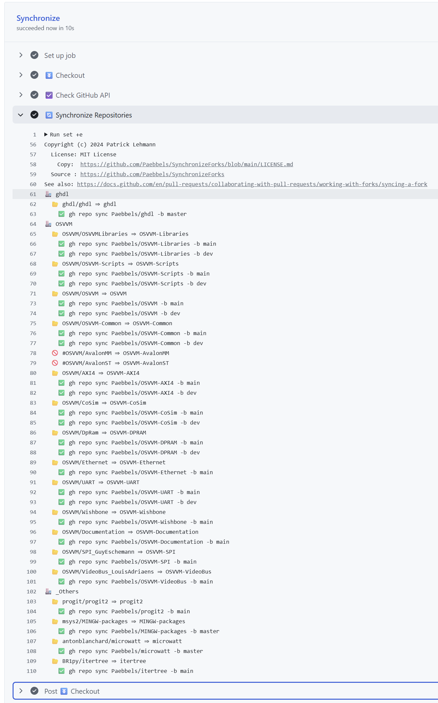

# Auto Synchronize forked repositories

This repository automates the synchronization of forked repositories for the GitHub namespace `Paebbels`. The
[GitHub Action pipeline](https://github.com/Paebbels/SynchronizeForks/blob/main/.github/workflows/Synchronize.yml) can
be copied to another repository and configuration files (`*.repos`) can be adjusted to achieve the same functionality
for other namespaces.

This code is licensed under [MIT License](LICENSE.md).


## Example Pipeline Log



## Steps to Setup

1. Create a repository like `SynchronizeForks` in your namespace.
2. Copy these files:
   * [README.md](https://github.com/Paebbels/SynchronizeForks/blob/main/README.md)
   * [LICENSE.md](https://github.com/Paebbels/SynchronizeForks/blob/main/LICENSE.md)
   * [.github/workflows/Synchronize.yml](https://github.com/Paebbels/SynchronizeForks/blob/main/.github/workflows/Synchronize.yml)
   * [.ALL.repos](https://github.com/Paebbels/SynchronizeForks/blob/main/.ALL.repos)
3. Configure `*.repos` files.
4. Push the commit and check the Action for success.


## Configuration File Formats

The `.ALL.repos` file is the entry point for the script listing all GitHub organisations that should be synchronized.
It lists one organisation per line or alternatively a comment starting with `#`. In case many single repositories from
various organisations or private accounts should be synchronized, it's recommended to add an `_Others` or `_Misc` entry.

**Example:**
```
ghdl
OSVVM
_Others
```

Each organisation has a matching `*.repos` file contains one repository per line. Alternatively, a comment starting
with `#`. A repository line has the following format:  
`<upstream>=<localRepository>:<branches>`

* `<upstream>` is formatted like `<organisation>/<repository>` or `<privateAccount>/<repository>`.
* `<localRepository>` is formatted like `<repository>`.  
  An account or organisation is not required, because it's inferred from the repository this script runs in.
* `<branches>` is a comma separated list of branch names like `<branch>,<branch>,<branch>`.
	
**Example:**
```
OSVVM/OSVVM=OSVVM:main,dev
OSVVM/AXI4=OSVVM-AXI4:main,dev
#OSVVM/AvalonST=OSVVM-AvalonST:main
```


## Synchronize repositories

* ghdl
  * GHDL
* OSVVM
  * OSVVM
  * OSVVM-Libraries
  * OSVVM-Scripts
  * OSVVM-Common
  * OSVVM-AXI4
  * OSVVM-UART
  * OSVVM-DPRAM
  * OSVVM-CoSim
  * OSVVM-Ethernet
  * OSVVM-Documentation
* *others*
  * progit2
  * msys2/MINGW-packages
  * antonblanchard/microwatt
  * BR1py/itertree


## GitHub CLI Documentation

See https://docs.github.com/en/pull-requests/collaborating-with-pull-requests/working-with-forks/syncing-a-fork


# License

This GitHub Action Example (source code) is licensed under [MIT License](LICENSE.md).

-------------------------
SPDX-License-Identifier: MIT
